# Cambridge Airbnb Market Analysis During COVID-19

The COVID-19 pandemic has disrupted many businesses and industries, including but not limited to the hospitality and aviation industries. The number of lodging reservations have gone down rapidly and significantly since March 2020. This project analyzes Airbnb data from Cambridge, MA and explore and investigate this market in the past 12 months.
Airbnb, Inc. is an American vacation rental online marketplace company accessible to consumers on its website or via an app.
The main objective of this project is to analyze the data to find any trend, seasonality, neighborhood differences, etc. in the market chosen, and to propose indicator(s) to quantify listings ‘performance; as well as to provide recommendations such as additional data sources that can be considered for future analysis.

## Data source and metadata

Data was acquired directly from the Airbnb website (http://insideairbnb.com/get-the-data.html). We worked with monthly detailed listings (listings.csv.gz), calendar (calendar.csv.gz), and review data (reviews.csv.gz) for Cambridge, MA. After data download, it needs to be extracted using any unzip package.
- listings - Detailed listings shows attributes for each of the listings. Some of the attributes used in our analysis are price (continuous), longitude (continuous), latitude (continuous), listing_type (categorical), is_superhost (categorical), neighborhood (categorical), ratings (continuous) among others.
- calendar - Provides details about booking for the next year by listing. Four attributes in total including listing_id (discrete), date (datetime), available (categorical) and price (continuous).
- reviews - Detailed reviews given by the guests. Key attributes include date (datetime), listing_id (discrete), reviewer_id (discrete) and comment (textual).

## Data Preprocessing & Exploratory Data Analysis
- Merge datasets for each month to one csv file for listings, calendar, reviews
- Transform the date column to an apropriate format - datetime
- Remove $ sign from the price column 
- Count the number of missing values in each dataset
- Drop columns with more than 70% of missing data
- Impute NaN values for host_name and comments columns with a new variable 'Unknown'
- Impute missing values using mean 
- Transfrom the host_is_superhost boolean True/False values to 1 and 0

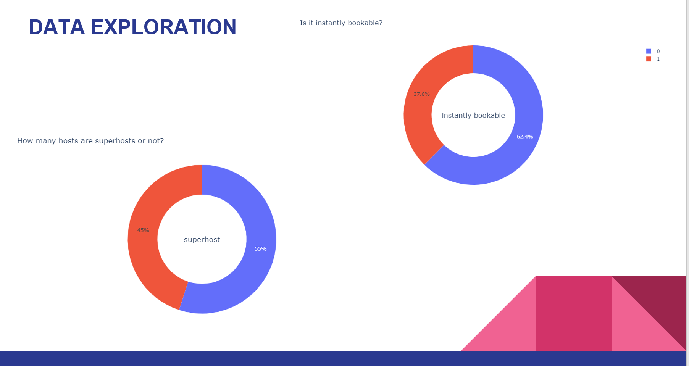

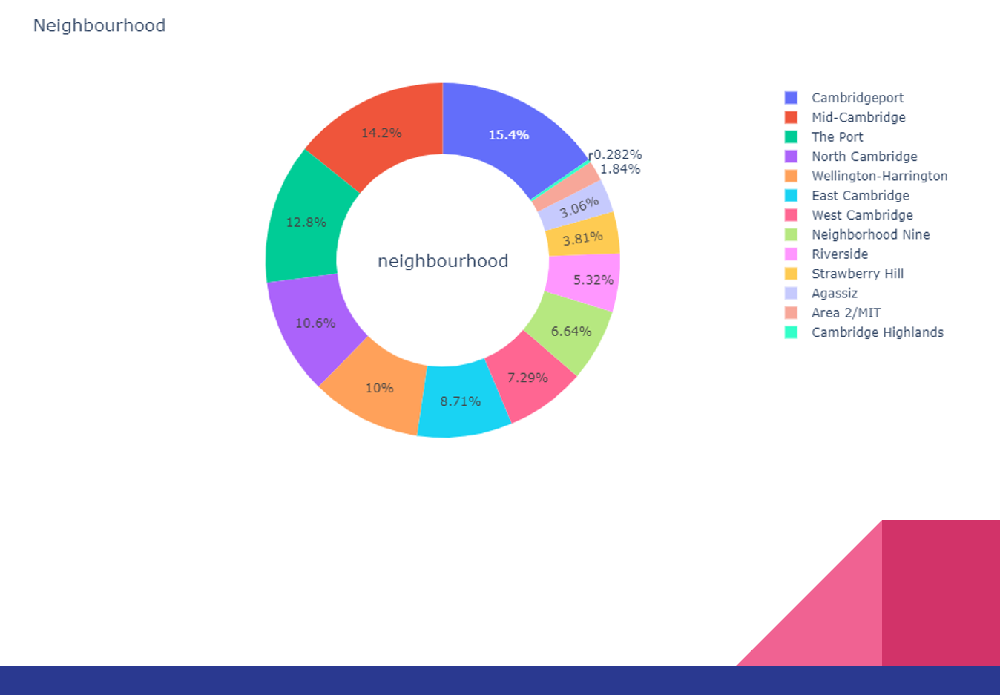
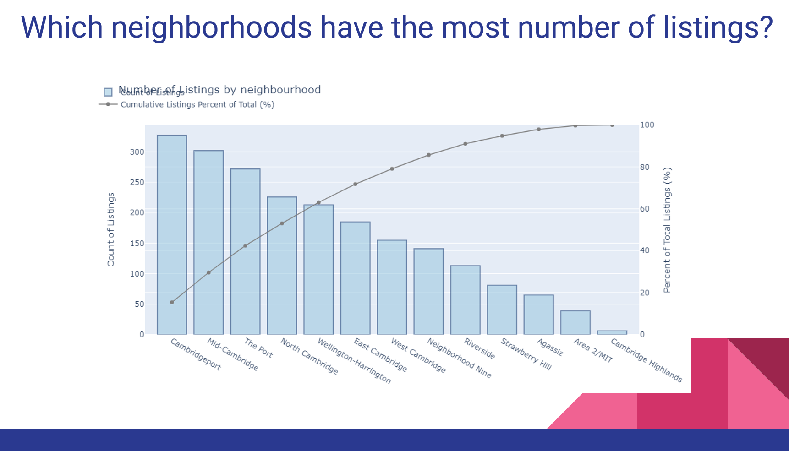
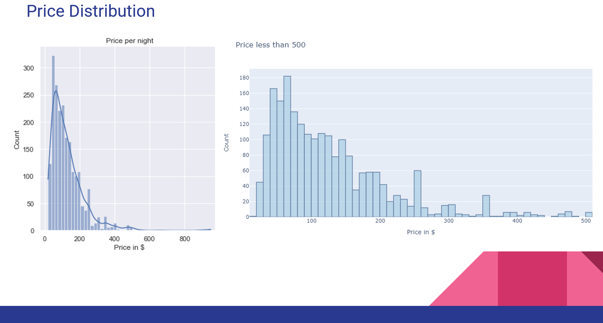
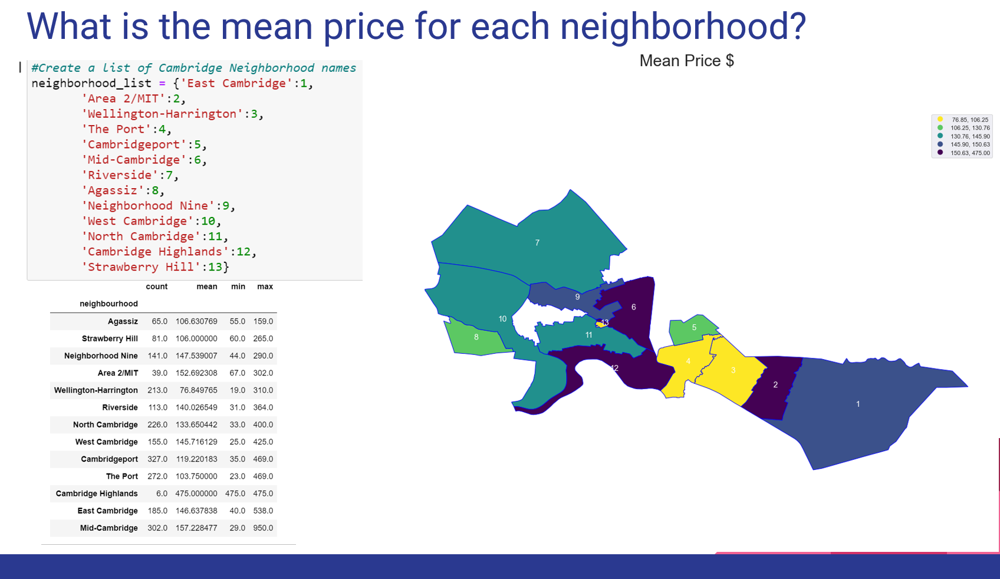
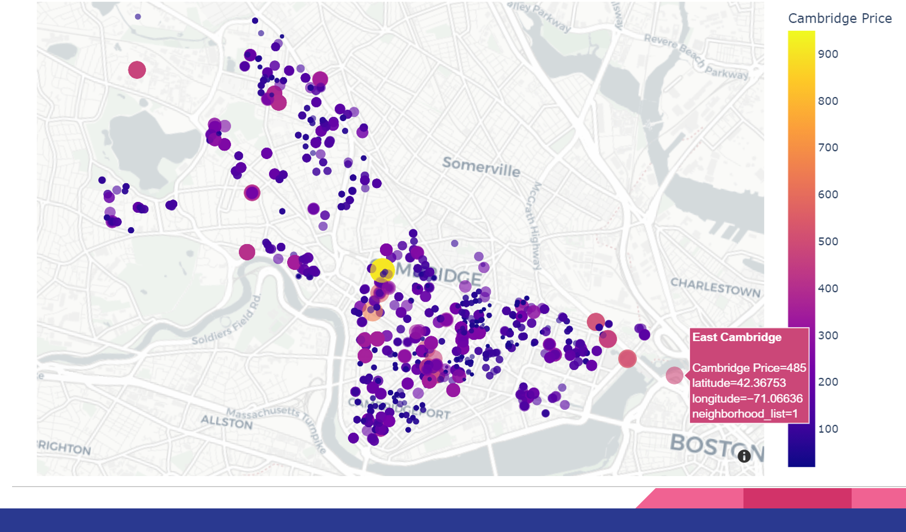
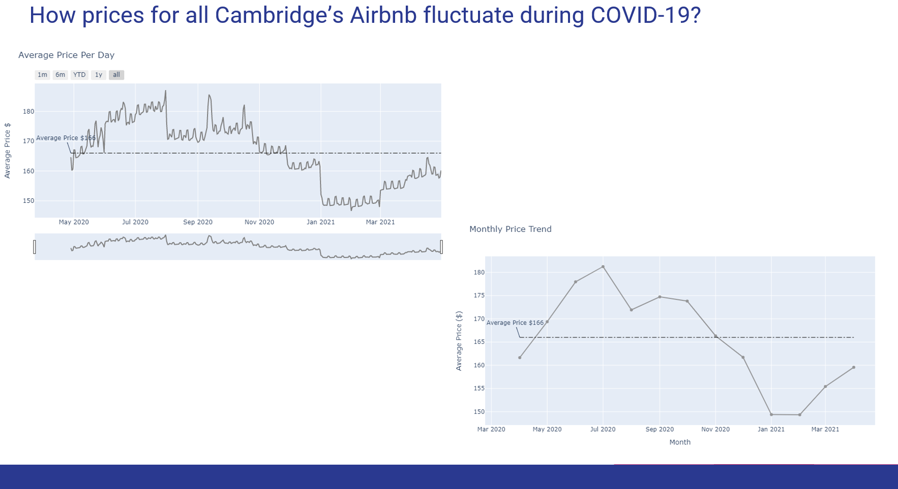

## Preparing the data for modeling
- Cleaning all the numerical data
- Preprocessing the categorical data. Re-encoding binary features by getting dummies for each unique value
- Drop features not needed for the further analysis

## Data Modeling
The goal was to create a model to illustrate what are the features that influence the price in Cambridge Airbnb 
- Split the data into test/train data sets
- Normalize the data to ensure the variables were interpreted correctly
- Predicting and obtaining a summary of the Ordinary least squares
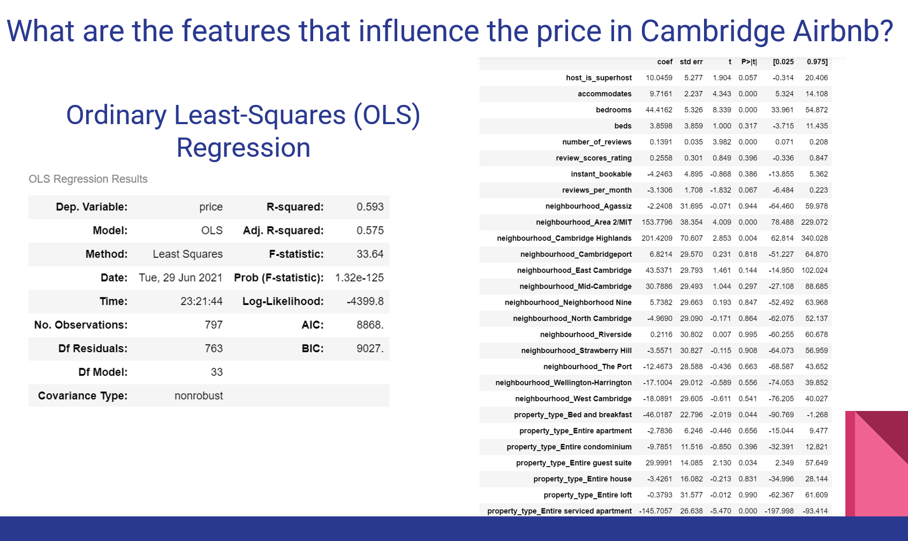
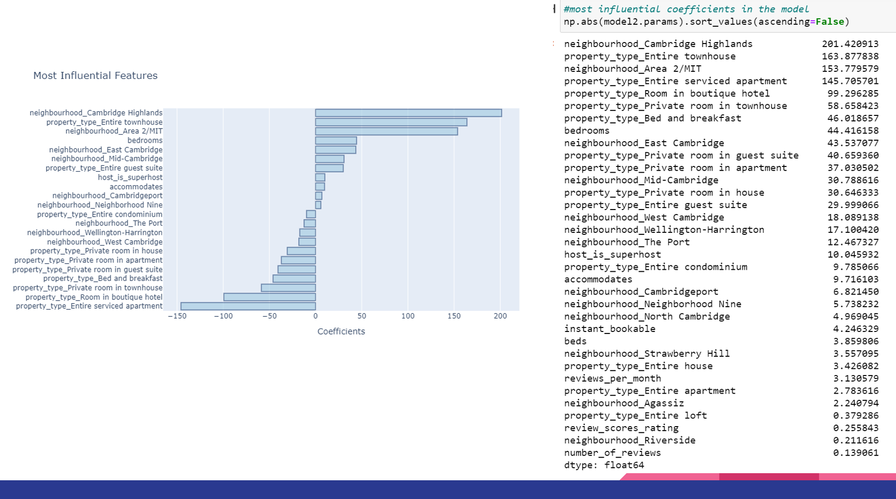
- Principal component analysis (PCA)
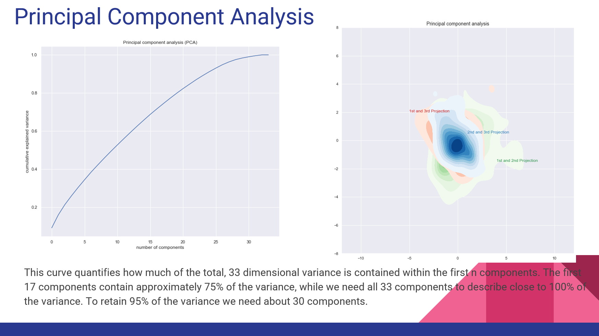
- Random Forest Approach
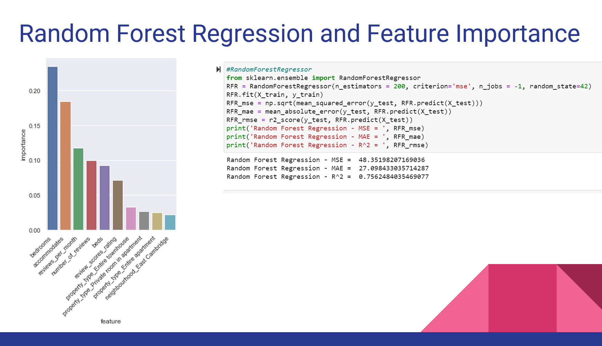
- Text Mining: Convert words to lower case; Remove quotation marks and digits; Remove punctuation; Normalize punctuation; Tokenization and padding; Remove stop words

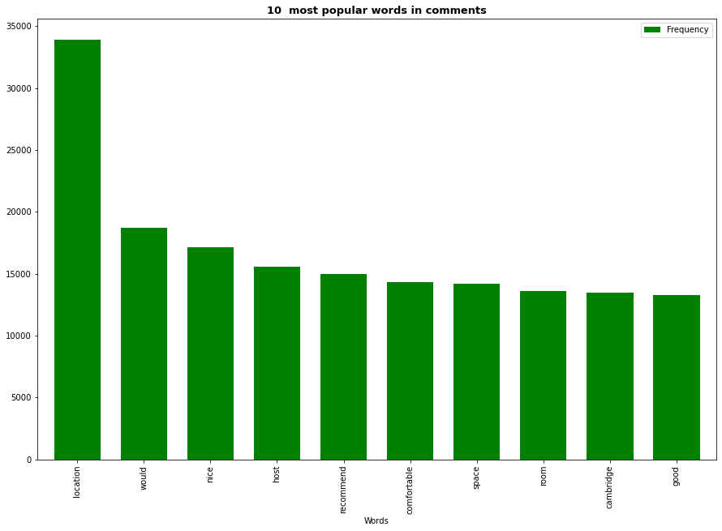
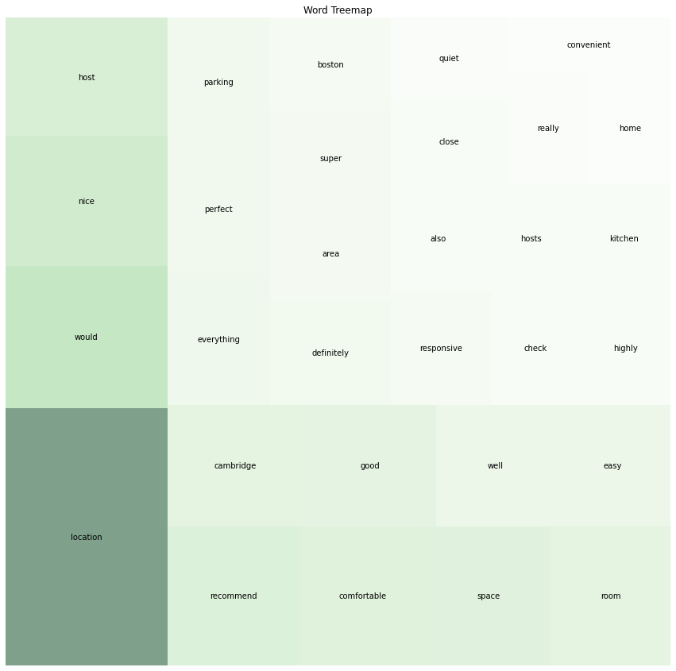

## Conclusions
-	COVID-19 affected Airbnb as any other businesses. Prices slowly are increasing but not at the level before the pandemic
-	A seasonality is observed in the price of the listings 
-	Private rooms and neighborhoods are highly significant for price
-	Number of bedrooms, accommodates , reviews, number of beds, entire apartment, private room, and East Cambridge neighborhood have more impact on predicting the price of Cambridge Airbnb listings by either increasing or decreasing the rental price
